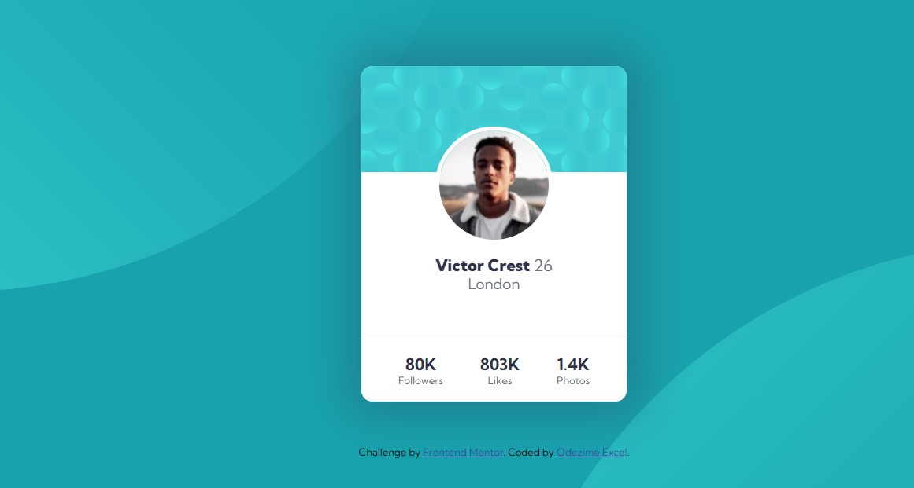

# Frontend Mentor - Profile card component solution

This is a solution to the [Profile card component challenge on Frontend Mentor](https://www.frontendmentor.io/challenges/profile-card-component-cfArpWshJ). Frontend Mentor challenges help you improve your coding skills by building realistic projects. 

## Table of contents

- [Overview](#overview)
  - [The challenge](#the-challenge)
  - [Screenshot](#screenshot)
  - [Links](#links)
- [My process](#my-process)
  - [Built with](#built-with)
  - [What I learned](#what-i-learned)
- [Author](#author)

## Overview

### The challenge

- Build out the project to the designs provided

### Screenshot


### Links

- Solution URL: [Add solution URL here](https://github.com/master-x2000/profile-card)
- Live Site URL: [Add live site URL here](https://master-x2000.github.io/profile-card/)

## My process

### Built with

- Semantic HTML5 markup
- CSS custom properties
- Flexbox

### What I learned

Making use of the "after and before" pseudo selector to place the background svg images.

To see how you can add code snippets, see below:

```css
body::before{
    content:"";
    width:100%;
    height:100svh;
    background-image:url(images/bg-pattern-top.svg);
    background-size:cover;
    background-repeat: no-repeat;
    position:absolute;
    top: -40%;
    left:-50%;
    transform: rotate(180deg);
}

body::after{
    content:"";
    width:100%;
    height:100svh;
    background-image:url(images/bg-pattern-bottom.svg);
    background-size:cover;
    background-repeat: no-repeat;
    position:absolute;
    bottom:-50%;
    right:-50%;
}
```

## Author

- Website - [Odezime Excel](https://master-x2000.github.io/profile-card/)
- Frontend Mentor - [@Master-X2000](https://www.frontendmentor.io/profile/master-x2000)
